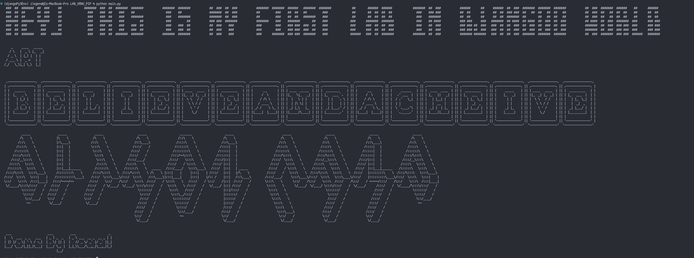
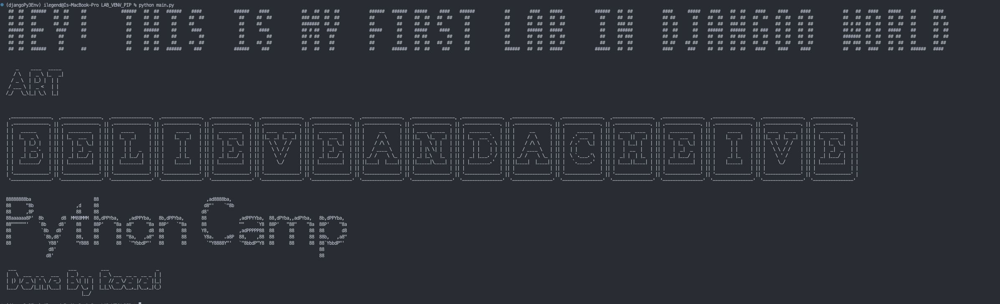
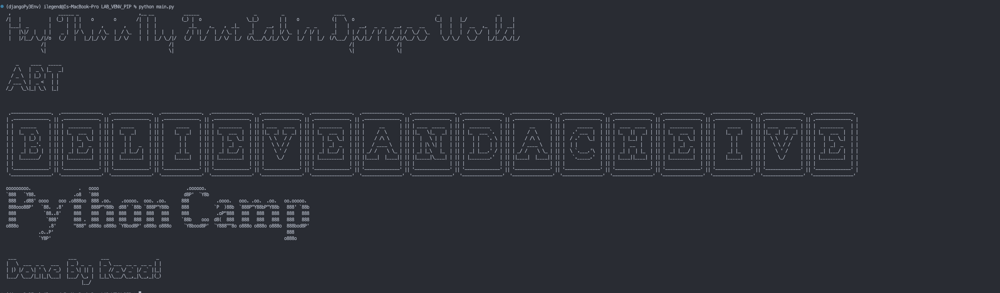
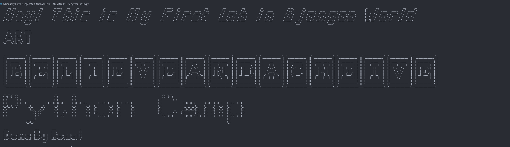

# LAB_VENV_PIP

## using what you've learned , create a new project to print Text Art in the terminal :
- [x] Create a virtual environment & activate it ->
```Python3 -m venv venv ```
- [x] Use ART package to print Text Art.-> ``` text2art("ART") ```
- [x] Print the phrase "BELIEVE and ACHEIVE" designed with font block. -> ```tprint("BELIEVE and ACHEIVE",font='block',chr_ignore=True)```


## Bonus
- [x] Come up with different phrases with different art and decoration


### checkout the package on pip
https://pypi.org/project/art/

## Different Output 👇 | 👀

```
First Output:
```
 
```
Second Output:
```


```
Third Output:
```


```
Fourth Output:
```
